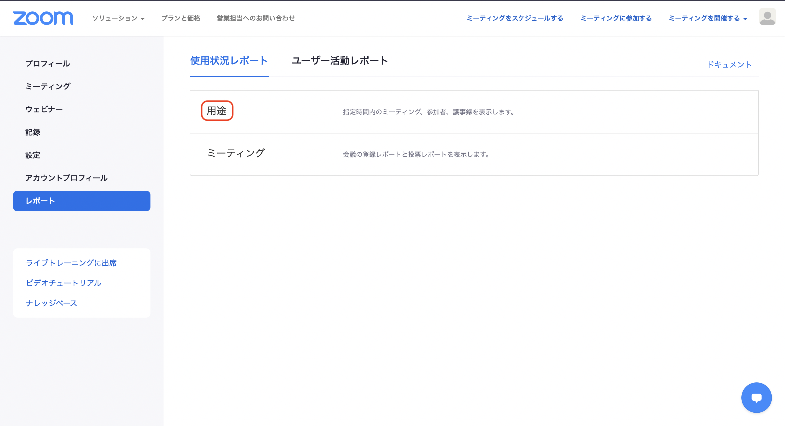
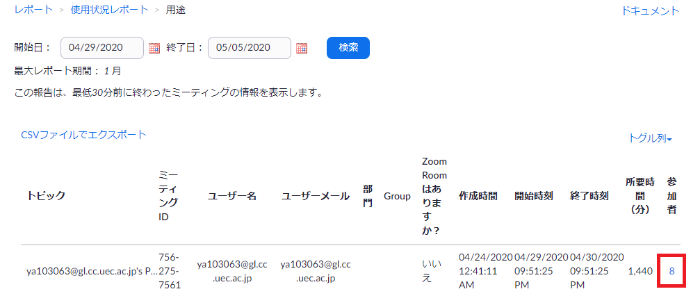
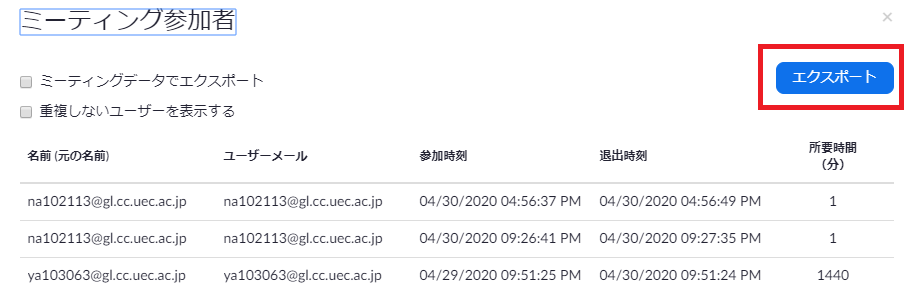

# ZOOM参加者一覧Download方法
## ブラウザからZOOMにログイン
[こちら](https://zoom.us/signin)からログインしてください．

## 「レポート」>「使用状況レポート」>「用途」をクリック

## ミーティングを検索し，該当ミーティングの「参加者」をクリック
- この時点で見えている「csvファイルでエクスポート」はミーティングのリストを書き出すだけなので<b>不要</b>．
 

 
引用: [https://www.inf.uec.ac.jp/onlect/wp-content/uploads/2020/05/zoom_attend30a.png](https://www.inf.uec.ac.jp/onlect/wp-content/uploads/2020/05/zoom_attend30a.png)

## 「エクスポート」をクリックし，ファイルをダウンロード 
- 「重複しないユーザーを表示する」のチェックは<b>外す</b>（おそらくデフォルトは外れているはずですが）．
 

 
引用: [https://www.inf.uec.ac.jp/onlect/wp-content/uploads/2020/05/zoom_attend3a.png](https://www.inf.uec.ac.jp/onlect/wp-content/uploads/2020/05/zoom_attend3a.png)

## ファイル名を「会場名_n日目.csv」に設定
例: Z12_1日目.csv
- 午前午後で一度立ち下げた場合は両方のファイルを「_AM」などとして設定する．（例: Z12_1日目_AM.csv, Z12_1日目_PM.csv）

### 注意事項
- 各ミーティングが終了しないとできないので表示されない場合は終了されてすぐ，または未だ終了していないので少し待ってから再度挑戦する．